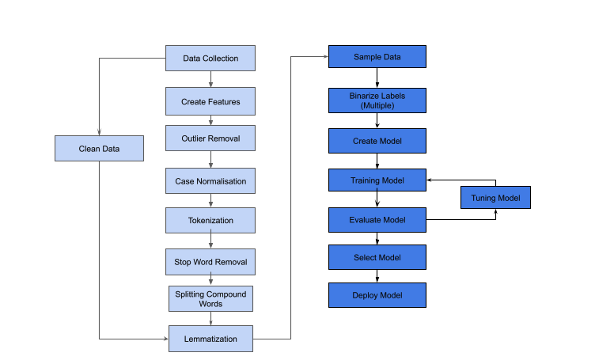
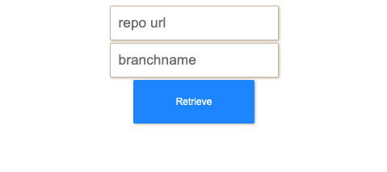
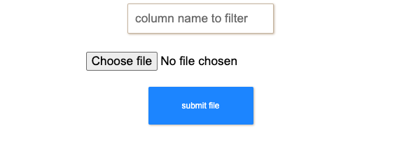

# Human Values Research: Swartz Values from code comments

<!-- markdown-toc start - Don't edit this section. Run M-x markdown-toc-refresh-toc -->
**Table of Contents**

- [Human Values Research: Swartz Values from code comments](#human-values-research-swartz-values-from-code-comments)
    - [-](#-)
        - [Label single comment using text area](#label-single-comment-using-text-area)
        - [Retrieve and predict all comment from git repository for human value mentions](#retrieve-and-predict-all-comment-from-git-repository-for-human-value-mentions)
        - [Upload and predict CSV files by specifying name of column](#upload-and-predict-csv-files-by-specifying-name-of-column)
        - [Requirements](#requirements)
    - [Machine learn](#machine-learn)
    - [Steps](#steps)
        - [Data Collection](#data-collection)
        - [Create Features](#create-features)
        - [Outlier Removal](#outlier-removal)
        - [Case normalisation](#case-normalisation)
        - [Tokenisation](#tokenisation)
        - [Stop word removal](#stop-word-removal)
        - [Split Compound words](#split-compound-words)
        - [Lemmatization](#lemmatization)
        - [Sample Data](#sample-data)
        - [Binarize Labels](#binarize-labels)
        - [Create Models](#create-models)
        - [Training Models](#training-models)
        - [Tune Models](#tune-models)
        - [Evaluate Models](#evaluate-models)
        - [Select Models](#select-models)
        - [Deploy Models](#deploy-models)

<!-- markdown-toc end -->

 

### How to use

#### Label single comment using text area
Simply place the comment that need labelling into the text area and submit
 

#### Retrieve and predict all comment from git repository for human value mentions
Select git repo link and enter name of branch in a similar fashion to cloning a git repository. A background queue will complete and create a download file once finish. **This could take a lone time**
 

#### Upload and predict CSV files by specifying name of column
Upload a csv file and specify a column to label in the csv file.
 

### Requirements
**celery** - For background queue and workers to handle background jobs for process heaving machine learning and file processing tasks  
**Flask** - For backend  
**Flask-WTF** - For validating data on frontend  
**pytest** - for testing  
**flower** - A dashboard to visualise process and tasks from background works in celery  
**chardet** - Helps with decoding different types of files  
**Flask-DebugToolbar** - Flask toolbar useful for debugging  
**GitPython** - Tool used to retrieve files from branches in github repositories  
**gunicorn** - WSGI python http server for UNIX based systems  
**Jinja2** - Tool used to help flask render templates  
**joblib** - used to dump machine learning models and vocabulary  
**matplotlib** - used to help visualise date and plotting  
**missingno** - used to help with visualising missing or empty data  
**nltk** - natural language processing toolkit  
**numpy** - used to facilitate mathematics operations inside python  
**pandas** - used to create dataframe and read csv files   
**regex** - used to for regular expressions  
**scikit-learn** - machien learning models   
**scipy** - helped with combining sparse matrices  
**seaborn**  
**sklearn** - used for creating machine learning models such as gbdt, knn, svc, decision trees, multiple layer perceptron and model selection  
**Werkzeug** - securely save files  
**redis** - a ram based database system to handle background workers and databases  

## Machine learn

## Steps

### Data Collection

### Create Features

### Outlier Removal

### Case normalisation

### Tokenisation

### Stop word removal

### Split Compound words

### Lemmatization

### Sample Data

### Binarize Labels

### Create Models

### Training Models

### Tune Models

### Evaluate Models

### Select Models

### Deploy Models

